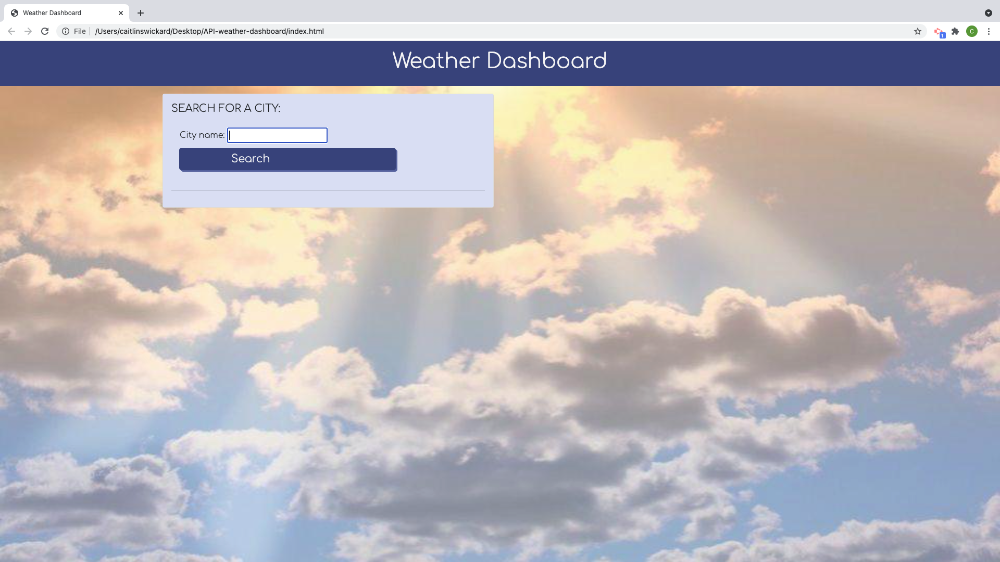
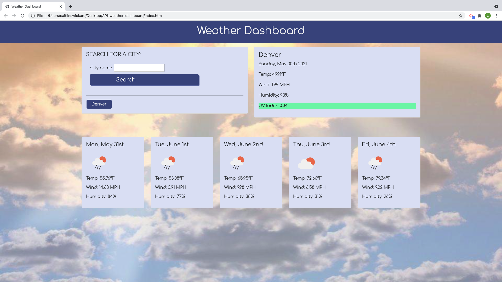
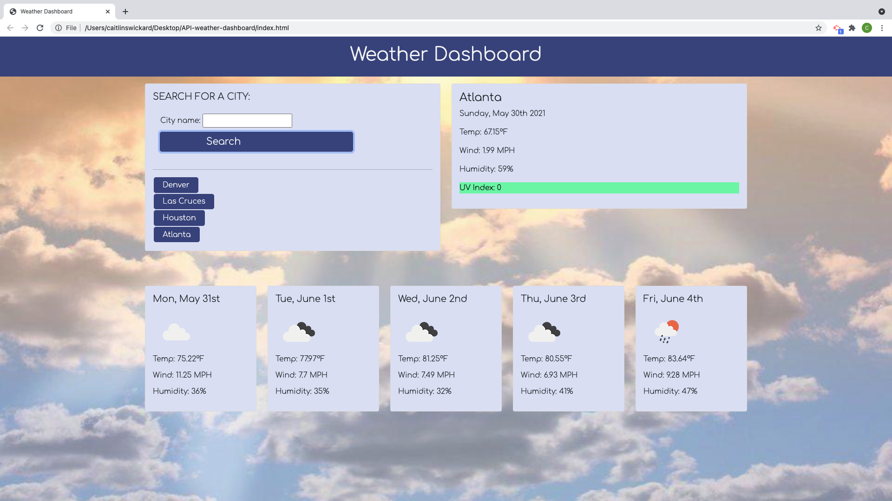

# Project: Weather Dashboard

This project is a Weather Dashboard for a city that the user wants to look up. This page will display the current weather for the city as well as a 5 day weather forecast. When the user searches a city, the city is added to search history below. They can view what cities they have checked the weather for. This page is getting information from the Open Weather One Call API to give the user the needed information.

[View deployed page here!](https://caitlinswickard.github.io/API-Weather-Dashboard/)

### Criteria

- GIVEN a weather dashboard with form inputs
- WHEN I search for a city
- THEN I am presented with current and future conditions for that city and that city is added to the search history
- WHEN I view current weather conditions for that city
- THEN I am presented with the city name, the date, an icon representation of weather conditions, the temperature, the humidity, the wind speed, and the UV index
- WHEN I view the UV index
- THEN I am presented with a color that indicates whether the conditions are favorable, moderate, or severe
- WHEN I view future weather conditions for that city
- THEN I am presented with a 5-day forecast that displays the date, an icon representation of weather conditions, the temperature, the wind speed, and the humidity
- WHEN I click on a city in the search history
- THEN I am again presented with current and future conditions for that city

## Built With

- HTML
- CSS
- Bootstrap
- JavaScript

## API used

- "https://api.openweathermap.org/data/2.5/weather"
- "https://api.openweathermap.org/data/2.5/onecall"

## Screen Shots

